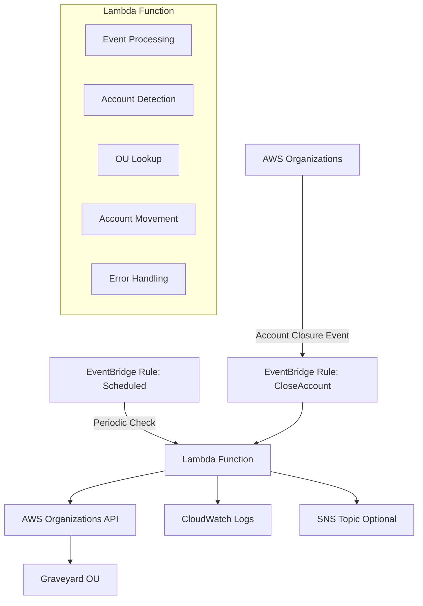

<!-- markdownlint-disable -->

<a href="https://www.appvia.io/"></a><br/><p align="right"> <a href="https://registry.terraform.io/modules/appvia/module-template/aws/latest"></a></a> <a href="https://github.com/appvia/terraform-aws-graveyard/releases/latest"></a> <a href="https://appvia-community.slack.com/join/shared_invite/zt-1s7i7xy85-T155drryqU56emm09ojMVA#/shared-invite/email"></a> <a href="https://github.com/appvia/terraform-aws-graveyard/graphs/contributors"></a>

<!-- markdownlint-restore -->
<!--
  ***** CAUTION: DO NOT EDIT ABOVE THIS LINE ******
-->


# Terraform AWS Graveyard Lambda

## Overview

The Terraform AWS Graveyard module provides an automated solution for managing closed AWS accounts within AWS Organizations. This module creates a comprehensive Lambda-based system that automatically identifies and moves suspended/closed accounts to a designated "Graveyard" Organizational Unit (OU), ensuring clean organizational structure and improved account lifecycle management.

**Deployment Context**: This module is designed to be deployed in your **AWS Organization Management Account** (formerly known as master account), as it requires organization-wide permissions to list and move accounts. It integrates seamlessly with AWS Landing Zone Accelerator (LZA), AWS Control Tower, or custom multi-account strategies.

## Purpose & Intent

### **Problem Statement**

As organizations scale their AWS infrastructure, managing account lifecycles becomes increasingly complex. Closed or suspended accounts often remain scattered throughout the organizational hierarchy, leading to:

- Cluttered organizational structure
- Difficulty in identifying active vs. inactive accounts
- Compliance and governance challenges
- Increased operational overhead
- Potential security risks from unmanaged accounts

### **Solution**

This module provides an automated, event-driven solution that:

- **Automatically detects** account closure events through AWS EventBridge
- **Intelligently processes** closed accounts with retry logic and error handling
- **Maintains organizational hygiene** by moving closed accounts to a designated Graveyard OU
- **Provides comprehensive monitoring** with CloudWatch logs and optional SNS notifications
- **Ensures reliability** through scheduled checks to catch any missed accounts

## Key Features

### 🔄 **Automated Account Management**

- **Event-Driven Processing**: Automatically triggers on AWS Organizations account closure events
- **Scheduled Reconciliation**: Periodic checks to ensure no closed accounts are missed
- **Intelligent Detection**: Identifies suspended accounts that need to be moved
- **Duplicate Prevention**: Skips accounts already in the Graveyard OU

### 🛡️ **Robust Error Handling**

- **Exponential Backoff Retry**: Automatically retries failed `MoveAccount` operations up to 3 times with exponential backoff (1s, 2s, 4s delays)
- **Comprehensive Logging**: Structured CloudWatch logs capture every step - account detection, OU lookup, movement attempts, and results
- **Graceful Degradation**: If one account fails to move, processing continues for remaining accounts instead of failing completely
- **Detailed Status Reporting**: Lambda returns JSON response with `processed_accounts`, `failed_accounts`, `total_processed`, and `total_failed` counts
- **Duplicate Prevention**: Automatically skips accounts already in the Graveyard OU to avoid unnecessary API calls

### 🔐 **Security & Compliance**

- **Least Privilege IAM Policy**: Lambda execution role is granted only the minimum required Organizations permissions:
  - `organizations:ListAccounts` - Enumerate all accounts in the organization
  - `organizations:ListRoots` - Identify the organization root
  - `organizations:ListOrganizationalUnitsForParent` - Recursively search for Graveyard OU
  - `organizations:ListParents` - Determine current parent of each account
  - `organizations:DescribeOrganizationalUnit` - Retrieve OU details
  - `organizations:MoveAccount` - Move suspended accounts to Graveyard OU
  - `sns:Publish` - Send notifications (only when SNS topic is configured)
- **Complete Audit Trail**: Every account movement is logged to CloudWatch with account ID, name, and destination OU
- **Encryption at Rest**: Optional KMS encryption for CloudWatch logs ensures sensitive account data is protected
- **Infrastructure as Code**: All resources are version-controlled and deployed via Terraform for reproducibility
- **Tagging Strategy**: Consistent resource tagging enables governance, cost allocation, and compliance reporting

### 📊 **Monitoring & Alerting**

- **CloudWatch Integration**: Comprehensive logging and metrics
- **SNS Notifications**: Optional notifications for account movements
- **Status Reporting**: Detailed success/failure reporting
- **Operational Visibility**: Clear visibility into processing results

### ⚙️ **Flexible Configuration**

- **Customizable Scheduling**: Configurable schedule expressions for periodic checks
- **Environment Variables**: Easy configuration through Lambda environment variables
- **Resource Naming**: Customizable resource names and descriptions
- **Tag Management**: Consistent tagging across all resources

## Architecture

### **System Components**



### **Data Flow**

**Event-Driven Flow:**
1. **Account Closure**: Administrator closes an AWS account through AWS Organizations
2. **CloudTrail Capture**: CloudTrail logs the `CloseAccount` event
3. **EventBridge Trigger**: EventBridge rule matches the event and invokes Lambda
4. **Lambda Processing**:
   - Lambda lists all accounts with `SUSPENDED` status
   - Recursively searches organization tree to find Graveyard OU by name
   - Identifies accounts not already in Graveyard OU
   - Attempts to move each account with retry logic
5. **Account Movement**: `MoveAccount` API call relocates suspended accounts to Graveyard OU
6. **Logging & Notification**: Results logged to CloudWatch; optional SNS notification sent

**Scheduled Reconciliation Flow:**
1. **Scheduled Trigger**: EventBridge rule fires based on `schedule_expression` (default: daily)
2. **Comprehensive Scan**: Lambda scans entire organization for suspended accounts
3. **Gap Closure**: Catches any accounts missed due to event delivery failures
4. **Same Processing**: Follows steps 4-6 from event-driven flow above

### **Security Model**

- **IAM Permissions**: Minimal required permissions for Organizations API access
- **EventBridge Integration**: Secure event-driven architecture
- **CloudWatch Logs**: Centralized logging with optional encryption
- **Resource Tagging**: Consistent tagging for governance and cost management

## Usage

### **The "Golden Path" - Simple Deployment**

The most common way to use this module with minimal configuration. This example is ideal for organizations just starting with automated account lifecycle management.

```hcl
module "graveyard" {
  source  = "appvia/graveyard/aws"
  version = "0.0.1"

  # Required: Name of the OU where closed accounts will be moved
  graveyard_ou_name = "Graveyard"

  # Required: IAM role name for the Lambda function
  lambda_role_name = "graveyard-lambda-role"

  # Required: Tags for all resources
  tags = {
    Environment = "production"
    ManagedBy   = "terraform"
    Purpose     = "account-lifecycle"
  }
}
```

This minimal configuration:
- Creates a Lambda function that runs daily to check for suspended accounts
- Automatically moves suspended accounts to the "Graveyard" OU
- Uses Python 3.13 runtime (latest supported version)
- Retains CloudWatch logs for 3 days (cost-optimized default)

### **The "Power User" - Advanced Configuration**

For organizations requiring enhanced monitoring, custom scheduling, and compliance features.

```hcl
module "graveyard" {
  source  = "appvia/graveyard/aws"
  version = "0.0.1"

  # Core configuration
  graveyard_ou_name    = "Closed-Accounts"
  lambda_function_name = "account-lifecycle-manager"
  lambda_description   = "Automated account graveyard with enhanced monitoring"
  lambda_role_path     = "/service-roles/"

  # Custom scheduling: Check every 6 hours instead of daily
  schedule_expression = "rate(6 hours)"

  # SNS notifications for account movements
  sns_topic_arn = "arn:aws:sns:us-east-1:123456789012:account-alerts"

  # Enhanced CloudWatch configuration
  cloudwatch_logs_retention_in_days = 90  # 90-day retention for audit
  cloudwatch_logs_kms_key_id        = "arn:aws:kms:us-east-1:123456789012:key/12345678-1234-1234-1234-123456789012"
  cloudwatch_logs_log_group_class   = "STANDARD"

  tags = {
    Environment      = "production"
    ManagedBy        = "terraform"
    Team             = "platform-engineering"
    CostCenter       = "shared-services"
    ComplianceLevel  = "high"
  }
}
```

This advanced setup adds:
- More frequent reconciliation checks (every 6 hours)
- SNS notifications when accounts are moved
- KMS encryption for CloudWatch logs
- Extended log retention for compliance auditing

### **The "Edge Case" - Multi-Region & Compliance**

For highly regulated industries requiring strict audit trails, encryption, and cron-based scheduling aligned with business hours.

```hcl
# Define local variables for reusability
locals {
  environment       = "production"
  compliance_kms_id = "arn:aws:kms:us-east-1:123456789012:key/abcd1234-5678-90ab-cdef-1234567890ab"

  common_tags = {
    Environment      = "production"
    ManagedBy        = "terraform"
    ComplianceLevel  = "hipaa-pci"
    DataRetention    = "7-years"
    AuditRequired    = "true"
    Team             = "compliance-platform"
  }
}

module "graveyard" {
  source  = "appvia/graveyard/aws"
  version = "0.0.1"

  # Core configuration
  graveyard_ou_name    = "HIPAA-Graveyard"
  lambda_role_name     = "hipaa-graveyard-role"
  lambda_function_name = "hipaa-account-graveyard"
  lambda_description   = "HIPAA-compliant account lifecycle management"
  lambda_role_path     = "/compliance/"

  # Cron schedule: Run at 2 AM UTC every day (aligned with maintenance window)
  schedule_expression = "cron(0 2 * * ? *)"

  # Compliance-grade CloudWatch configuration
  cloudwatch_logs_retention_in_days = 2557  # 7 years for HIPAA compliance
  cloudwatch_logs_kms_key_id        = local.compliance_kms_id
  cloudwatch_logs_log_group_class   = "STANDARD"

  # SNS topic for compliance team notifications
  sns_topic_arn = "arn:aws:sns:us-east-1:123456789012:compliance-critical-alerts"

  tags = local.common_tags
}

# Additional CloudWatch alarm for monitoring Lambda failures
resource "aws_cloudwatch_metric_alarm" "graveyard_errors" {
  alarm_name          = "graveyard-lambda-errors"
  comparison_operator = "GreaterThanThreshold"
  evaluation_periods  = "1"
  metric_name         = "Errors"
  namespace           = "AWS/Lambda"
  period              = "300"
  statistic           = "Sum"
  threshold           = "0"
  alarm_description   = "Alert on any Lambda execution errors"
  alarm_actions       = ["arn:aws:sns:us-east-1:123456789012:compliance-critical-alerts"]

  dimensions = {
    FunctionName = "hipaa-account-graveyard"
  }

  tags = local.common_tags
}
```

This compliance-focused setup includes:
- 7-year log retention for HIPAA/PCI-DSS requirements
- KMS encryption for all logs
- Cron-based scheduling during maintenance windows
- Custom IAM role path for organizational segregation
- Additional CloudWatch alarms for operational monitoring
- Structured tagging strategy for compliance reporting

## Operational Context

### **Known Limitations**

Before deploying this module, be aware of these AWS service limitations and design considerations:

1. **Account Movement Limitations**
   - AWS Organizations may throttle `MoveAccount` API calls. The Lambda includes exponential backoff retry logic (3 attempts) to handle transient failures.
   - Accounts can only be moved between OUs within the same organization.
   - The Lambda timeout is set to 30 seconds, which should be sufficient for most scenarios but may need adjustment for very large organizations.

2. **OU Lookup Behavior**
   - The module recursively searches the entire organization tree to find the Graveyard OU by name.
   - If multiple OUs exist with the same name, the first match in the tree traversal will be used.
   - The Graveyard OU **must exist** before deploying this module - it is not created automatically.

3. **Account Status Detection**
   - The module only processes accounts with status `SUSPENDED` (which is AWS's designation for closed accounts).
   - Newly closed accounts may take a few minutes to appear in EventBridge events due to eventual consistency.
   - The scheduled reconciliation job ensures no accounts are missed due to event delivery failures.

4. **IAM Permissions**
   - The Lambda function requires organization-wide read permissions (`organizations:List*`, `organizations:Describe*`).
   - The `organizations:MoveAccount` permission has organization-wide scope and cannot be restricted to specific OUs.
   - If using SNS notifications, ensure the Lambda execution role can publish to the specified topic.

5. **Event-Driven Processing**
   - EventBridge rules monitor CloudTrail for `CloseAccount` events. Ensure CloudTrail is enabled in your organization management account.
   - The module creates two separate event triggers: one for real-time events and one for scheduled reconciliation.

6. **Cost Considerations**
   - CloudWatch Logs retention defaults to 3 days to minimize costs. For compliance use cases, increase retention as needed.
   - Lambda invocations are typically infrequent (scheduled checks + occasional account closures), resulting in minimal compute costs.
   - Consider using CloudWatch Logs Infrequent Access class for long-term retention to reduce storage costs.

### **AWS Service Quotas to Monitor**

- **EventBridge**: 300 rules per region (default) - this module creates 2 rules
- **Lambda**: 1000 concurrent executions per region (default) - this function is not compute-intensive
- **Organizations API**: Rate limits apply to `ListAccounts` and `MoveAccount` operations

## Monitoring & Troubleshooting

### **CloudWatch Logs**

The module creates comprehensive CloudWatch logs for monitoring and debugging. The log group name follows the pattern `/aws/lambda/<lambda_function_name>` (default: `/aws/lambda/lza-graveyard`).

```bash
# View recent logs (replace with your function name if customized)
aws logs tail /aws/lambda/lza-graveyard --follow

# Search for errors
aws logs filter-log-events \
  --log-group-name /aws/lambda/lza-graveyard \
  --filter-pattern "ERROR"

# Search for successful account movements
aws logs filter-log-events \
  --log-group-name /aws/lambda/lza-graveyard \
  --filter-pattern "moved to Graveyard"
```

### **Key Log Messages**

| Log Level | Message | Description |
|-----------|---------|-------------|
| INFO | `Found closed account to process: {account_id} ({account_name})` | Account identified for processing |
| INFO | `Account {account_id} moved to Graveyard OU: {ou_id}` | Successful account movement |
| INFO | `Skipping closed account {account_id} - already in Graveyard OU` | Account already processed |
| WARN | `Attempt {n} failed for account {account_id}. Retrying in {delay} seconds...` | Retry attempt |
| ERROR | `Error processing account {account_id}: {error}` | Account processing failed |

### **Common Issues & Solutions**

#### **1. OU Not Found Error**

```
Error: Could not find OU with name: Graveyard
```

**Solution**: Ensure the Graveyard OU exists in your AWS Organizations structure.

#### **2. Permission Denied**

```
Error: User is not authorized to perform: organizations:MoveAccount
```

**Solution**: Verify the Lambda execution role has the required Organizations permissions.

#### **3. Account Already in Target OU**

```
Skipping closed account 123456789012 - already in Graveyard OU
```

**Status**: This is normal behavior, not an error.

### **Monitoring Best Practices**

1. **Set up CloudWatch Alarms** for Lambda errors and failures
2. **Monitor Lambda duration** to detect performance issues
3. **Track account movement metrics** for operational visibility
4. **Set up SNS notifications** for critical events

### **Testing the Module**

After deployment, you can manually invoke the Lambda function to test account detection and movement:

```bash
# Test the Lambda function directly (replace function name if customized)
aws lambda invoke \
  --function-name lza-graveyard \
  --payload '{}' \
  response.json

# Check the response for processed/failed accounts
cat response.json | jq '.'

# Expected output structure:
# {
#   "statusCode": 200,
#   "body": {
#     "processed_accounts": ["123456789012"],
#     "failed_accounts": [],
#     "total_processed": 1,
#     "total_failed": 0
#   }
# }

# View the CloudWatch logs immediately after invocation
aws logs tail /aws/lambda/lza-graveyard --since 5m --follow
```

## Requirements

### **Prerequisites**

Before deploying this module, ensure you have:

- **AWS Organizations**: Your AWS environment must have Organizations enabled and be deployed in the organization management account
- **Graveyard OU Created**: The target Organizational Unit must exist before deploying this module - create it manually or via Infrastructure as Code
- **CloudTrail Enabled**: Required for EventBridge to capture `CloseAccount` events (should be enabled in the management account)
- **IAM Permissions**: The identity deploying this module needs permissions to create Lambda functions, IAM roles, EventBridge rules, and CloudWatch log groups
- **Terraform**: Version >= 1.0.7
- **AWS Provider**: Version >= 5.0.0

### **AWS Services Used**

| Service | Purpose | Required |
|---------|---------|----------|
| AWS Lambda | Executes account movement logic (Python 3.13 runtime) | Yes |
| AWS EventBridge | Triggers Lambda on account closure events and scheduled intervals | Yes |
| AWS Organizations | Lists accounts and moves closed accounts to Graveyard OU | Yes |
| AWS CloudWatch Logs | Stores Lambda execution logs for monitoring and debugging | Yes |
| AWS SNS | Sends notifications when accounts are moved (optional) | No |
| AWS KMS | Encrypts CloudWatch logs (optional, for compliance) | No |
| AWS CloudTrail | Captures organization events for EventBridge (must be pre-configured) | Yes |

## Update Documentation

The `terraform-docs` utility is used to generate this README. Follow the below steps to update:

1. Make changes to the `.terraform-docs.yml` file
2. Fetch the `terraform-docs` binary (<https://terraform-docs.io/user-guide/installation/>)
3. Run `terraform-docs markdown table --output-file ${PWD}/README.md --output-mode inject .`

<!-- BEGIN_TF_DOCS -->
## Providers

| Name | Version |
|------|---------|
| <a name="provider_aws"></a> [aws](#provider\_aws) | >= 5.0.0 |

## Inputs

| Name | Description | Type | Default | Required |
|------|-------------|------|---------|:--------:|
| <a name="input_graveyard_ou_name"></a> [graveyard\_ou\_name](#input\_graveyard\_ou\_name) | Name of the Organizational Unit where closed accounts should be moved | `string` | n/a | yes |
| <a name="input_tags"></a> [tags](#input\_tags) | Default tags to apply to all resources | `map(string)` | n/a | yes |
| <a name="input_cloudwatch_logs_kms_key_id"></a> [cloudwatch\_logs\_kms\_key\_id](#input\_cloudwatch\_logs\_kms\_key\_id) | KMS key ID for encrypting CloudWatch logs | `string` | `null` | no |
| <a name="input_cloudwatch_logs_log_group_class"></a> [cloudwatch\_logs\_log\_group\_class](#input\_cloudwatch\_logs\_log\_group\_class) | Class for the CloudWatch log group | `string` | `"STANDARD"` | no |
| <a name="input_cloudwatch_logs_retention_in_days"></a> [cloudwatch\_logs\_retention\_in\_days](#input\_cloudwatch\_logs\_retention\_in\_days) | Number of days to retain CloudWatch logs | `number` | `3` | no |
| <a name="input_lambda_description"></a> [lambda\_description](#input\_lambda\_description) | Description of the Lambda function | `string` | `"Function to move closed accounts to the Graveyard OU"` | no |
| <a name="input_lambda_function_name"></a> [lambda\_function\_name](#input\_lambda\_function\_name) | Name of the Lambda function | `string` | `"lza-graveyard"` | no |
| <a name="input_lambda_role_path"></a> [lambda\_role\_path](#input\_lambda\_role\_path) | Path for the IAM role for the Lambda function | `string` | `"/service-role/"` | no |
| <a name="input_lambda_runtime"></a> [lambda\_runtime](#input\_lambda\_runtime) | Runtime for the Lambda function | `string` | `"python3.13"` | no |
| <a name="input_schedule_expression"></a> [schedule\_expression](#input\_schedule\_expression) | Schedule expression for periodic account checks (e.g., 'rate(1 day)' or 'cron(0 12 * * ? *)') | `string` | `"rate(1 day)"` | no |
| <a name="input_sns_topic_arn"></a> [sns\_topic\_arn](#input\_sns\_topic\_arn) | ARN of the SNS topic for account movement notifications | `string` | `null` | no |

## Outputs

| Name | Description |
|------|-------------|
| <a name="output_lambda_arn"></a> [lambda\_arn](#output\_lambda\_arn) | The ARN of the Lambda function |
<!-- END_TF_DOCS -->
