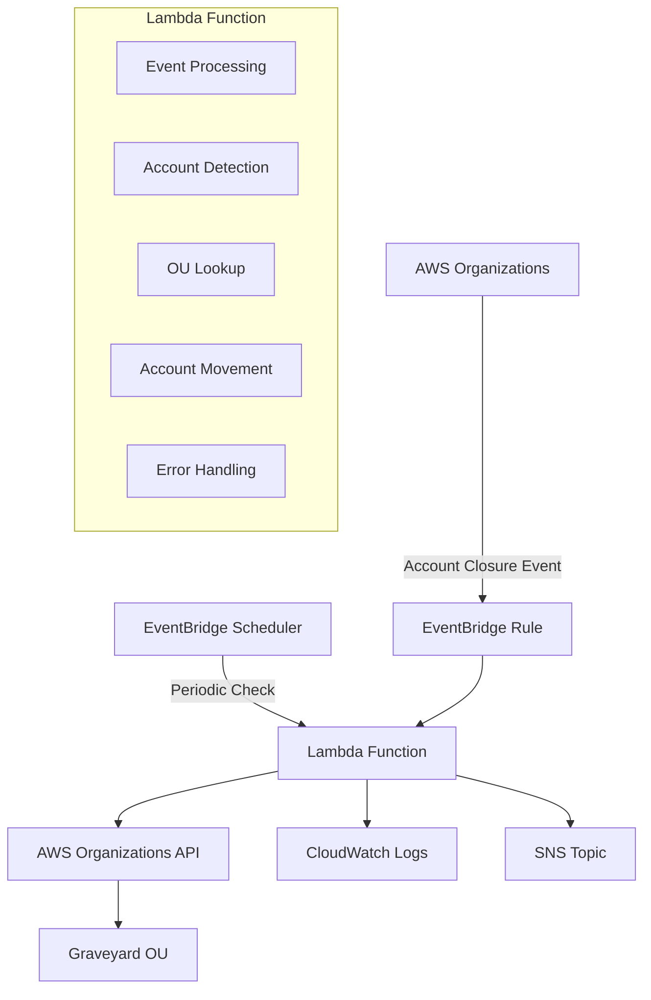

<!-- markdownlint-disable -->

<a href="https://www.appvia.io/"></a><br/><p align="right"> <a href="https://registry.terraform.io/modules/appvia/module-template/aws/latest"></a></a> <a href="https://github.com/appvia/terraform-aws-graveyard/releases/latest"></a> <a href="https://appvia-community.slack.com/join/shared_invite/zt-1s7i7xy85-T155drryqU56emm09ojMVA#/shared-invite/email"></a> <a href="https://github.com/appvia/terraform-aws-graveyard/graphs/contributors"></a>

<!-- markdownlint-restore -->
<!--
  ***** CAUTION: DO NOT EDIT ABOVE THIS LINE ******
-->


# Terraform AWS Graveyard Lambda

## Overview

The Terraform AWS Graveyard module provides an automated solution for managing closed AWS accounts within AWS Organizations. This module creates a comprehensive Lambda-based system that automatically identifies and moves suspended/closed accounts to a designated "Graveyard" Organizational Unit (OU), ensuring clean organizational structure and improved account lifecycle management.

## Purpose & Intent

### **Problem Statement**

As organizations scale their AWS infrastructure, managing account lifecycles becomes increasingly complex. Closed or suspended accounts often remain scattered throughout the organizational hierarchy, leading to:

- Cluttered organizational structure
- Difficulty in identifying active vs. inactive accounts
- Compliance and governance challenges
- Increased operational overhead
- Potential security risks from unmanaged accounts

### **Solution**

This module provides an automated, event-driven solution that:

- **Automatically detects** account closure events through AWS EventBridge
- **Intelligently processes** closed accounts with retry logic and error handling
- **Maintains organizational hygiene** by moving closed accounts to a designated Graveyard OU
- **Provides comprehensive monitoring** with CloudWatch logs and optional SNS notifications
- **Ensures reliability** through scheduled checks to catch any missed accounts

## Key Features

### 🔄 **Automated Account Management**

- **Event-Driven Processing**: Automatically triggers on AWS Organizations account closure events
- **Scheduled Reconciliation**: Periodic checks to ensure no closed accounts are missed
- **Intelligent Detection**: Identifies suspended accounts that need to be moved
- **Duplicate Prevention**: Skips accounts already in the Graveyard OU

### 🛡️ **Robust Error Handling**

- **Retry Logic**: Implements exponential backoff for transient failures
- **Comprehensive Logging**: Detailed CloudWatch logs for monitoring and debugging
- **Graceful Degradation**: Continues processing other accounts if one fails
- **Error Reporting**: Tracks both successful and failed account movements

### 🔐 **Security & Compliance**

- **Least Privilege Access**: Minimal IAM permissions required for operation
- **Audit Trail**: Complete logging of all account movements
- **Encryption Support**: Optional KMS encryption for CloudWatch logs
- **Tagging Support**: Consistent resource tagging for governance

### 📊 **Monitoring & Alerting**

- **CloudWatch Integration**: Comprehensive logging and metrics
- **SNS Notifications**: Optional notifications for account movements
- **Status Reporting**: Detailed success/failure reporting
- **Operational Visibility**: Clear visibility into processing results

### ⚙️ **Flexible Configuration**

- **Customizable Scheduling**: Configurable schedule expressions for periodic checks
- **Environment Variables**: Easy configuration through Lambda environment variables
- **Resource Naming**: Customizable resource names and descriptions
- **Tag Management**: Consistent tagging across all resources

## Architecture

### **System Components**



### **Data Flow**

1. **Event Detection**: AWS Organizations account closure events trigger EventBridge
2. **Lambda Invocation**: EventBridge invokes the Lambda function
3. **Account Processing**: Lambda identifies closed accounts not in Graveyard OU
4. **Account Movement**: Closed accounts are moved to the designated Graveyard OU
5. **Logging & Notification**: Results are logged and optionally sent via SNS

### **Security Model**

- **IAM Permissions**: Minimal required permissions for Organizations API access
- **EventBridge Integration**: Secure event-driven architecture
- **CloudWatch Logs**: Centralized logging with optional encryption
- **Resource Tagging**: Consistent tagging for governance and cost management

## Usage

### **Basic Usage**

```hcl
module "aws_graveyard_lambda" {
  source  = "appvia/graveyard/aws"
  version = "0.0.1"

  # Required variables
  graveyard_ou_name = "Graveyard"
  lambda_role_name  = "graveyard-lambda-role"

  # Optional configuration
  schedule_expression = "rate(1 day)"
  lambda_function_name = "aws-account-graveyard"
  
  tags = {
    Environment = "prod"
    Managed_by  = "terraform"
    Purpose     = "account-management"
    Team        = "platform"
  }
}
```

### **Advanced Configuration**

```hcl
module "aws_graveyard_lambda" {
  source  = "appvia/graveyard/aws"
  version = "0.0.1"

  # Required variables
  graveyard_ou_name = "Closed-Accounts"
  lambda_role_name  = "account-graveyard-role"

  # Lambda configuration
  lambda_function_name = "aws-account-graveyard"
  lambda_description   = "Automated account graveyard management"
  lambda_runtime       = "python3.9"
  lambda_role_path     = "/service-roles/"

  # Scheduling
  schedule_expression = "cron(0 12 * * ? *)"  # Daily at noon UTC

  # Monitoring and alerting
  sns_topic_arn = "arn:aws:sns:us-east-1:123456789012:account-alerts"

  # CloudWatch configuration
  cloudwatch_logs_retention_in_days = 30
  cloudwatch_logs_log_group_class   = "STANDARD"
  cloudwatch_logs_kms_key_id        = "arn:aws:kms:us-east-1:123456789012:key/12345678-1234-1234-1234-123456789012"

  tags = {
    Environment   = "production"
    Managed_by    = "terraform"
    Purpose       = "account-lifecycle-management"
    Team          = "platform-engineering"
    Cost_Center   = "infrastructure"
    Compliance    = "required"
  }
}
```

### **Use Cases**

#### **1. Enterprise Account Lifecycle Management**

```hcl
# For large enterprises with complex organizational structures
module "enterprise_graveyard" {
  source = "appvia/graveyard/aws"
  
  graveyard_ou_name = "Enterprise-Graveyard"
  lambda_role_name  = "enterprise-graveyard-role"
  
  # More frequent checks for large organizations
  schedule_expression = "rate(6 hours)"
  
  # Enhanced monitoring
  sns_topic_arn = var.account_management_sns_topic
  
  tags = {
    Environment = "prod"
    Business_Unit = "IT"
    Compliance_Level = "high"
  }
}
```

#### **2. Multi-Environment Setup**

```hcl
# Development environment
module "dev_graveyard" {
  source = "appvia/graveyard/aws"
  
  graveyard_ou_name = "Dev-Graveyard"
  lambda_role_name  = "dev-graveyard-role"
  
  schedule_expression = "rate(1 day)"
  
  tags = {
    Environment = "dev"
    Purpose     = "account-cleanup"
  }
}

# Production environment
module "prod_graveyard" {
  source = "appvia/graveyard/aws"
  
  graveyard_ou_name = "Prod-Graveyard"
  lambda_role_name  = "prod-graveyard-role"
  
  # More frequent checks in production
  schedule_expression = "rate(4 hours)"
  
  # Enhanced monitoring and alerting
  sns_topic_arn = var.prod_alerting_sns_topic
  cloudwatch_logs_retention_in_days = 90
  
  tags = {
    Environment = "prod"
    Purpose     = "account-cleanup"
    Criticality = "high"
  }
}
```

#### **3. Compliance-Focused Setup**

```hcl
# For organizations with strict compliance requirements
module "compliance_graveyard" {
  source = "appvia/graveyard/aws"
  
  graveyard_ou_name = "Compliance-Graveyard"
  lambda_role_name  = "compliance-graveyard-role"
  
  # Enhanced logging and encryption
  cloudwatch_logs_kms_key_id        = var.compliance_kms_key
  cloudwatch_logs_retention_in_days = 2557  # 7 years
  cloudwatch_logs_log_group_class   = "STANDARD"
  
  # Immediate notifications
  sns_topic_arn = var.compliance_sns_topic
  
  tags = {
    Environment     = "prod"
    Compliance      = "required"
    Data_Retention  = "7-years"
    Audit_Required  = "true"
  }
}
```

## Monitoring & Troubleshooting

### **CloudWatch Logs**

The module creates comprehensive CloudWatch logs for monitoring and debugging:

```bash
# View recent logs
aws logs tail /aws/lambda/lza-graveyard --follow

# Search for specific events
aws logs filter-log-events \
  --log-group-name /aws/lambda/lza-graveyard \
  --filter-pattern "ERROR"
```

### **Key Log Messages**

| Log Level | Message | Description |
|-----------|---------|-------------|
| INFO | `Found closed account to process: {account_id} ({account_name})` | Account identified for processing |
| INFO | `Account {account_id} moved to Graveyard OU: {ou_id}` | Successful account movement |
| INFO | `Skipping closed account {account_id} - already in Graveyard OU` | Account already processed |
| WARN | `Attempt {n} failed for account {account_id}. Retrying in {delay} seconds...` | Retry attempt |
| ERROR | `Error processing account {account_id}: {error}` | Account processing failed |

### **Common Issues & Solutions**

#### **1. OU Not Found Error**

```
Error: Could not find OU with name: Graveyard
```

**Solution**: Ensure the Graveyard OU exists in your AWS Organizations structure.

#### **2. Permission Denied**

```
Error: User is not authorized to perform: organizations:MoveAccount
```

**Solution**: Verify the Lambda execution role has the required Organizations permissions.

#### **3. Account Already in Target OU**

```
Skipping closed account 123456789012 - already in Graveyard OU
```

**Status**: This is normal behavior, not an error.

### **Monitoring Best Practices**

1. **Set up CloudWatch Alarms** for Lambda errors and failures
2. **Monitor Lambda duration** to detect performance issues
3. **Track account movement metrics** for operational visibility
4. **Set up SNS notifications** for critical events

### **Testing the Module**

```bash
# Test the Lambda function directly
aws lambda invoke \
  --function-name lza-graveyard \
  --payload '{}' \
  response.json

# Check the response
cat response.json
```

## Requirements

### **Prerequisites**

- AWS Organizations enabled
- Appropriate IAM permissions for Organizations API
- Graveyard OU must exist in your organization
- Terraform >= 1.0

### **AWS Services Used**

- AWS Lambda
- AWS EventBridge
- AWS Organizations
- AWS CloudWatch Logs
- AWS SNS (optional)
- AWS KMS (optional)

## Update Documentation

The `terraform-docs` utility is used to generate this README. Follow the below steps to update:

1. Make changes to the `.terraform-docs.yml` file
2. Fetch the `terraform-docs` binary (<https://terraform-docs.io/user-guide/installation/>)
3. Run `terraform-docs markdown table --output-file ${PWD}/README.md --output-mode inject .`

<!-- BEGIN_TF_DOCS -->
## Providers

| Name | Version |
|------|---------|
| <a name="provider_aws"></a> [aws](#provider\_aws) | >= 5.0.0 |

## Inputs

| Name | Description | Type | Default | Required |
|------|-------------|------|---------|:--------:|
| <a name="input_graveyard_ou_name"></a> [graveyard\_ou\_name](#input\_graveyard\_ou\_name) | Name of the Organizational Unit where closed accounts should be moved | `string` | n/a | yes |
| <a name="input_lambda_role_name"></a> [lambda\_role\_name](#input\_lambda\_role\_name) | Name of the IAM role for the Lambda function | `string` | n/a | yes |
| <a name="input_tags"></a> [tags](#input\_tags) | Default tags to apply to all resources | `map(string)` | n/a | yes |
| <a name="input_cloudwatch_logs_kms_key_id"></a> [cloudwatch\_logs\_kms\_key\_id](#input\_cloudwatch\_logs\_kms\_key\_id) | KMS key ID for encrypting CloudWatch logs | `string` | `null` | no |
| <a name="input_cloudwatch_logs_log_group_class"></a> [cloudwatch\_logs\_log\_group\_class](#input\_cloudwatch\_logs\_log\_group\_class) | Class for the CloudWatch log group | `string` | `"STANDARD"` | no |
| <a name="input_cloudwatch_logs_retention_in_days"></a> [cloudwatch\_logs\_retention\_in\_days](#input\_cloudwatch\_logs\_retention\_in\_days) | Number of days to retain CloudWatch logs | `number` | `3` | no |
| <a name="input_lambda_description"></a> [lambda\_description](#input\_lambda\_description) | Description of the Lambda function | `string` | `"Function to move closed accounts to the Graveyard OU"` | no |
| <a name="input_lambda_function_name"></a> [lambda\_function\_name](#input\_lambda\_function\_name) | Name of the Lambda function | `string` | `"lza-graveyard"` | no |
| <a name="input_lambda_role_path"></a> [lambda\_role\_path](#input\_lambda\_role\_path) | Path for the IAM role for the Lambda function | `string` | `"/service-role/"` | no |
| <a name="input_lambda_runtime"></a> [lambda\_runtime](#input\_lambda\_runtime) | Runtime for the Lambda function | `string` | `"python3.13"` | no |
| <a name="input_schedule_expression"></a> [schedule\_expression](#input\_schedule\_expression) | Schedule expression for periodic account checks (e.g., 'rate(1 day)' or 'cron(0 12 * * ? *)') | `string` | `"rate(1 day)"` | no |
| <a name="input_sns_topic_arn"></a> [sns\_topic\_arn](#input\_sns\_topic\_arn) | ARN of the SNS topic for account movement notifications | `string` | `null` | no |

## Outputs

No outputs.
<!-- END_TF_DOCS -->
